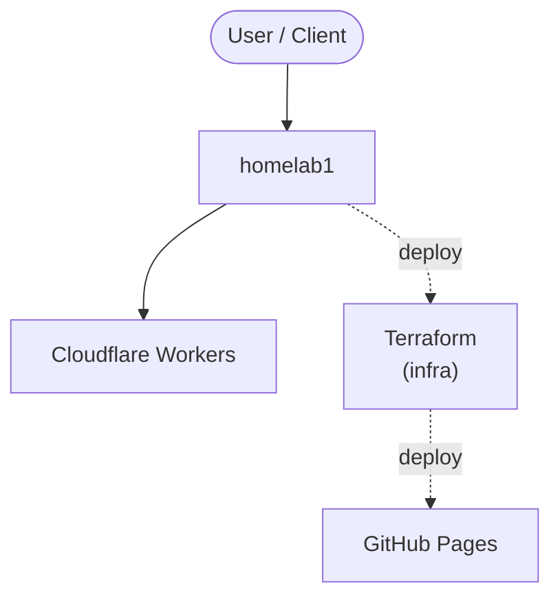

# Context Map — `homelab1`

> Auto-generated architecture & deployment context map. Summarizes the core application, container/cloud footprint, and database connections. Regenerate after significant structural changes.

**Repo:** `avnit/homelab1` · **Original** · Public · Primary language: HTML · Default branch: `master` · Files: 26

## 1. Core application

homelab-selfhosted-stack

## 2. Containers & cloud applications

**Infrastructure as Code:**
- `terraform/coolify/main.tf`
- `terraform/coolify/outputs.tf`
- `terraform/coolify/variables.tf`
- `terraform/khuedoan-homelab-sandbox/main.tf`
- `terraform/khuedoan-homelab-sandbox/outputs.tf`
- `terraform/khuedoan-homelab-sandbox/variables.tf`

**Detected cloud platforms / services:** Cloudflare Workers, Terraform, Vercel, Netlify, Heroku, GitHub Pages

## 3. Database connections

_No database drivers or connection strings detected._

## 4. Architecture diagram

## 5. Security posture

- **Static scan findings:** 6 high, 3 medium

| Severity | Rule | File:Line |
|---|---|---|
| high | curl-pipe-shell | `README.md:6` |
| high | curl-pipe-shell | `proxmox-helper-scripts/README.md:6` |
| high | curl-pipe-shell | `proxmox-helper-scripts/harden-community-scripts.sh:6` |
| high | curl-pipe-shell | `terraform/coolify/README.md:41` |
| high | curl-pipe-shell | `terraform/khuedoan-homelab-sandbox/cloud-init.yaml.tftpl:74` |
| high | curl-pipe-shell | `terraform/khuedoan-homelab-sandbox/cloud-init.yaml.tftpl:76` |
| medium | js-innerhtml | `dashboard/index.html:196` |
| medium | hardcoded-ssh-known-hosts-off | `provision/finish-coolify-install.sh:16` |

---
_Generated by repo context-mapping pass on 2026-08-13._